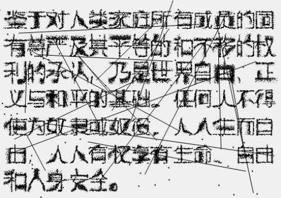

# OCR-Interference
一个简单的HTML页面，基于JS实现了通过文本生成抗OCR识别的图像。

可以设置部分干扰参数或点线干扰。

详见 `index.html` 文件

## 示例
源文本：

> 鉴于对人类家庭所有成员的固有尊严及其平等的和不移的权利的承认，乃是世界自由、正义与和平的基础。任何人不得使为奴隶或奴役，人人生而自由，人人有权享有生命、自由和人身安全。

干扰图像：（失真级别2、波频4、波幅3、随机点数量100、随机线数量20）

